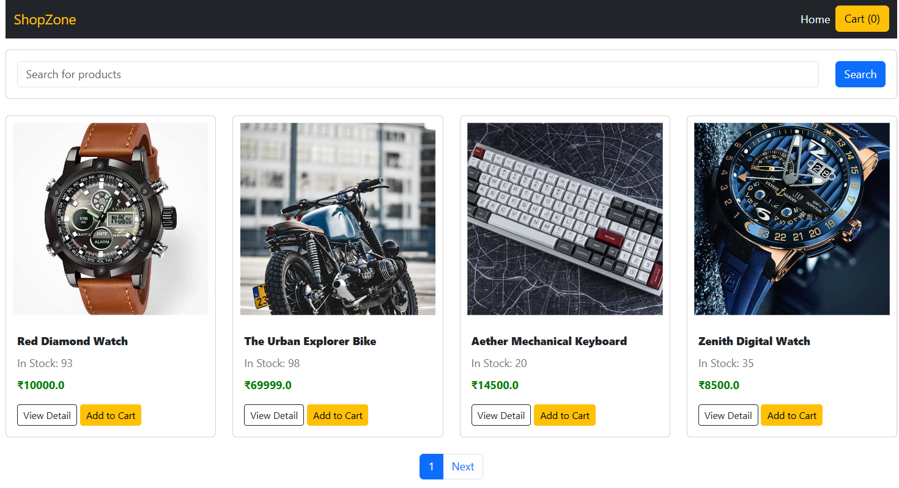
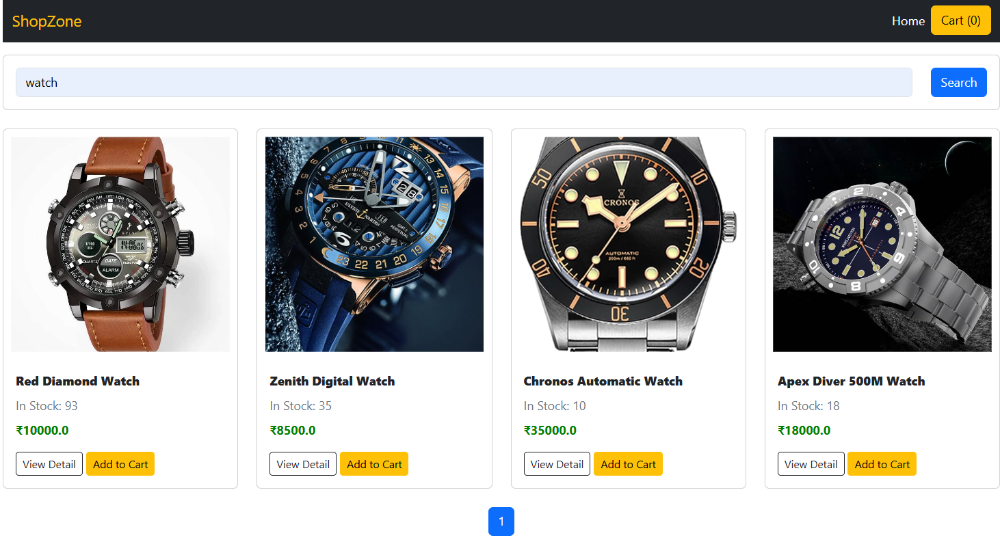
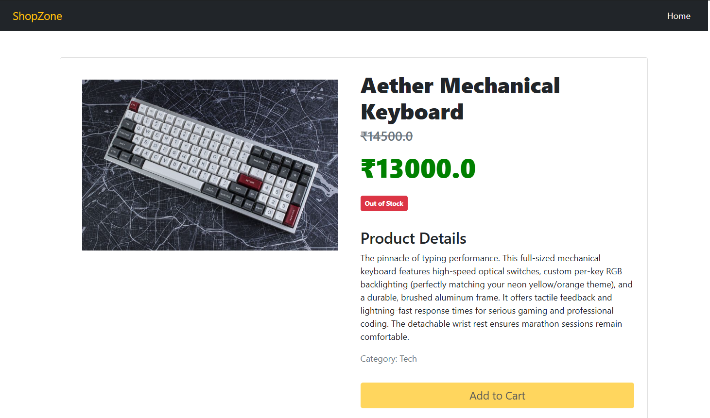
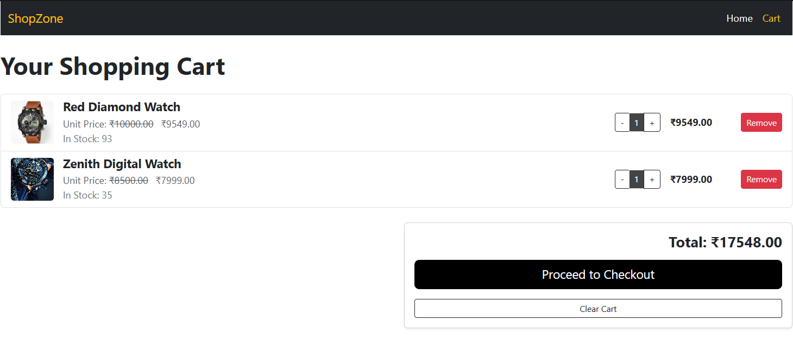
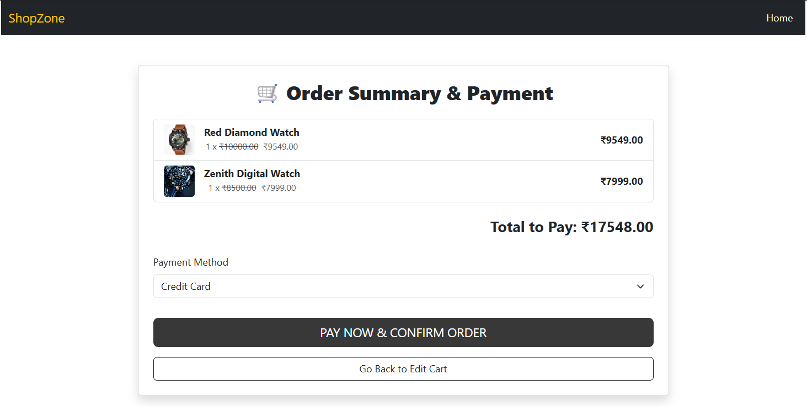
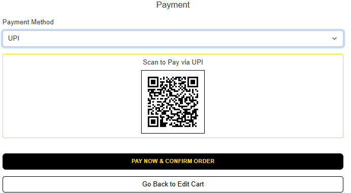
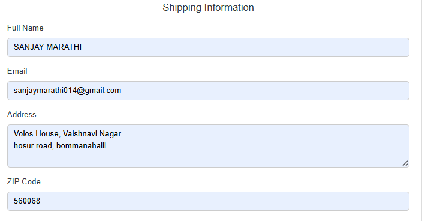
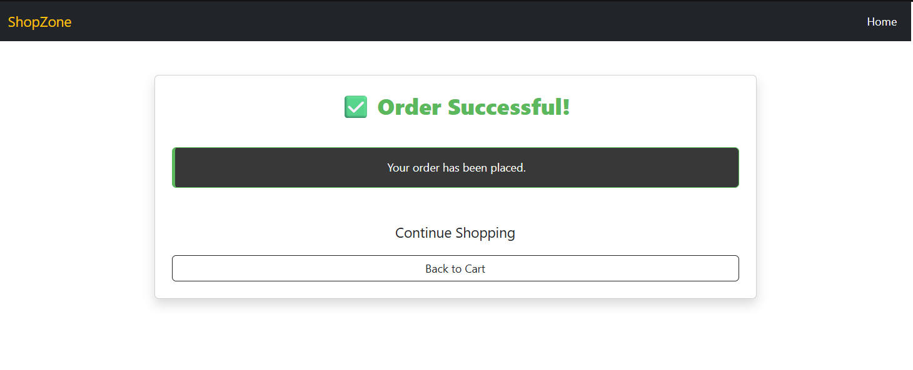

# 📸 Screenshots
### <p align="center">🛍️ Product Catalog Page (Home)</p>
<p align="center">
  
</p>
<p align="center">
  The main product catalog page. Displays all items with name, price (discounted), image, and stock status in the dark theme. Includes pagination and a search bar.
</p>

---

### <p align="center">🔍 Search & Filter Bar</p>
<p align="center">
  
</p>
<p align="center">
  High-contrast search bar that allows filtering of products by item name. Integrated directly into the main product catalog page.
</p>

---

### <p align="center">💎 Item Detail View</p>
<p align="center">
  
</p>
<p align="center">
  Opens when a customer taps on a product. Shows a larger image, full description, and clear display of original vs. discount price.
</p>

---

### <p align="center">🛒 Shopping Cart Management</p>
<p align="center">
  
</p>
<p align="center">
  Displays selected items, quantity controls, and calculates the total price using the discount price. The final button initiates the two-step checkout process.
</p>

---

### <p align="center">💳 Checkout Summary & Payment Step</p>
<p align="center">
  

</p>
<p align="center">
  The mandatory final step showing the order summary, total price, and the <b>PAY NOW & CONFIRM ORDER</b> button which triggers transactional stock deduction.
</p>

---
### <p align="center">🛒 Shopping Information</p>
<p align="center">
  
</p>
<p align="center">
  Displays essential shopping details such as cart items, total price, quantity updates, remove item option, and checkout flow. Styled in the same dark/yellow theme for consistency. It ensures a smooth shopping experience with real-time updates.
</p>

---

### <p align="center">🎉 Order Successful Page</p>
<p align="center">
  
</p>
<p align="center">
  Final confirmation page shown after a successful transaction. Confirms that <b>stock has been deducted</b> and prompts the user to continue shopping (clearing the local storage cart).
</p>

---

# 🛒 ShopZone – High-Contrast E-Commerce Platform

ShopZone is a modern Django project that provides: 
<p>✅ A high-contrast, dark-themed online product catalog.</p>
<p>✅ A secure, transactional checkout system with atomic stock deduction.</p>
<p>✅ Comprehensive inventory and product management (via Django Admin).</p>

This is not a simple template — it is a secure e-commerce solution focusing on premium presentation and data integrity.
---

# ✅ Key Features

## 💻 Backend / Inventory Integrity
```
• **Atomic Stock Deduction:** Uses Django transactions to guarantee stock reduction or full rollback.
• **Concurrency Safety:** Employs select_for_update() to prevent overselling during simultaneous checkouts.
• **Discount Logic:** Checkout automatically validates and applies the discount_price if it's lower than the original price.
• **Stock Tracking:** Stock is checked client-side and verified again server-side at checkout.
```

---

## 📱 Shopper Experienc
```
• High-Contrast UI: Dark theme accented by vibrant Orange/Yellow for a premium feel.
• Persistent Cart: Uses local storage (JS/jQuery) to maintain cart items across sessions.
• Price Clarity: Clearly displays original price with a strike-through next to the discounted price.
• Two-Step Checkout: Provides an Order Summary step before final payment confirmation.  
```

---

# 💻 Technology Stack
```
Backend: Django 5 (Python)
Database Safety: django.db.transaction + select_for_update
Frontend: Bootstrap 5 + Custom CSS (Dark Theme/Orange Accents)
Client Cart: JavaScript (localStorage) / jQuery
Database: SQLite (Development)  
```

---

# ⚙️ Setup & Installation

### 1️⃣ Clone Repository
```
git clone https://github.com/SanjayMarathi/ShopZone.git
cd ShopZone
```

---

### 2️⃣ Create & Activate Virtual Environment
```
python -m venv venv
```

**Windows**
```
.\venv\Scripts\activate
```

**macOS/Linux**
```
source venv/bin/activate
```

---

### 3️⃣ Install Dependencies
```
pip install -r requirements.txt
```

---

### 4️⃣ Apply Migrations
```
python manage.py makemigrations myapp
python manage.py migrate
```

---

### 5️⃣ Create Superuser
```
python manage.py createsuperuser
```

---

### 6️⃣ Run Server
```
python manage.py runserver
```

App opens at:

```
http://127.0.0.1:8000/
```

---

# 🚦 Usage Guide

## ✅ Staff / Admin Workflow
```
1. Login to Admin Panel → http://127.0.0.1:8000/admin/
2. **Manage Products:** Add, edit, or delete items, setting price, discount, and stock.
3. **Monitor Database:** All successful transactions lead to atomic stock deduction.
```

Dashboard:
```
http://127.0.0.1:8000
```

---

## ✅ Customer Workflow
```
1. Login to Admin Panel → http://127.0.0.1:8000/admin/
2. **Manage Products:** Add, edit, or delete items, setting price, discount, and stock.
3. **Monitor Database:** All successful transactions lead to atomic stock deduction.
```
---

# ✅ Project Structure
```
ShopZone/
│── shop/
│   ├── templates/shop/
│   │   ├── index.html       # Product Catalog
│   │   ├── cart.html        # Cart Management
│   │   ├── checkout.html    # Summary / Status Page
│   │   └── detail.html      # Individual Product View
│   ├── static/shop/
│   │   └── style.css        # Custom Dark Theme
│   ├── models.py            # Products (with stock and discount_price)
│   └── views.py             # Transactional Checkout logic
│
│── ecomsite/
│   ├── settings.py
│   └── urls.py
```
---

# ✅ Author
```
Developed by: Sanjay Marathi
GitHub: https://github.com/SanjayMarathi
```

---

